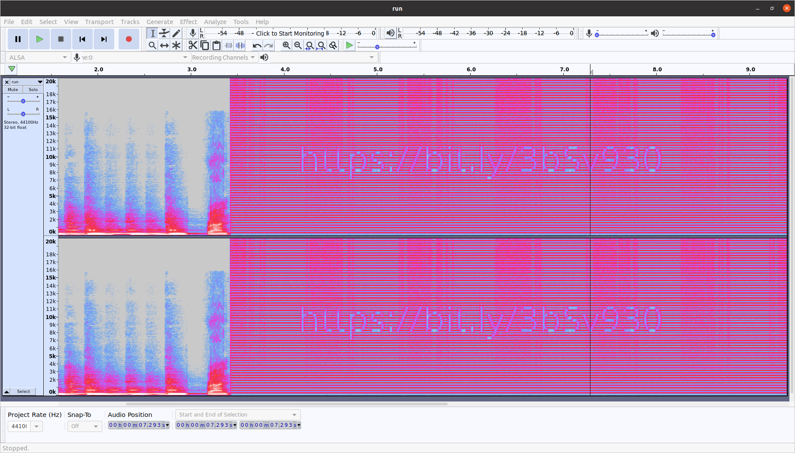

# Around the World
> 500 points

## Description 
> Thank you for narrowing down the unF0r7un@t3s base of operations in "Hash Browns". We figured out that the password was the city and zip code of where 
> they would be located. We have noticed a high level of suspicious activity near the “Laser Game Evolution Grenoble”. Please look into this location’s details. 
> You may want to interview people who have been there before, and ask them if they had noticed anything strange.

## Solution
This challenge was full of ***"Redirections"*** where every step gives us a new challenge to solve :p

### Hack No. 1
* Searching for the location - [Laser Game Evolution Grenoble](https://www.google.com/maps/place/Laser+Game+Evolution+Grenoble/@45.1814089,5.7186979,17z/data=!3m1!4b1!4m5!3m4!1s0x478af490911f48d5:0x382f2e8c712550fd!8m2!3d45.1814089!4d5.7208866)
on Google Maps leads to a comment from the Challenge Author (YoshiBoi).

* The comment said ***Very 35u03gO with the bitly***. Okay, I think I got it! Goto - [http://bit.ly/35u03gO](http://bit.ly/35u03gO) which redirects to a 
[Google Doc](https://docs.google.com/document/d/1b8o84Kp-LaFNCl9p_IHblmA3c1OELBOKuP54iVCdcn0/edit).

### Hack No. 2
* The Google Doc had some binaries which had another ***bit.ly*** link after decoding.  
* Decoded Data - [CyberChef result](https://gchq.github.io/CyberChef/#recipe=From_Binary('Space')From_Hex('Auto')&input=MDAxMTAxMTAgMDAxMTAwMTAgMDAxMDAwMDAgMDAxMTAxMTAgMDAxMTEwMDEgMDAxMDAwMDAgMDAxMTAxMTEgMDAxMTAxMDAgMDAxMDAwMDAgMDAxMTAwMTAgMDExMDAxMDEgMDAxMDAwMDAgMDAxMTAxMTAgMDExMDAwMTEgMDAxMDAwMDAgMDAxMTAxMTEgMDAxMTEwMDEgMDAxMDAwMDAgMDAxMTAwMTAgMDExMDAxMTAgMDAxMDAwMDAgMDAxMTAwMTEgMDAxMTAwMTEgMDAxMDAwMDAgMDAxMTAxMTAgMDExMDAxMDAgMDAxMDAwMDAgMDAxMTAxMTAgMDAxMTAxMTEgMDAxMDAwMDAgMDAxMTAxMTEgMDExMDAwMDEgMDAxMDAwMDAgMDAxMTAxMDAgMDAxMTAwMTAgMDAxMDAwMDAgMDAxMTAxMTAgMDAxMTAxMTEgMDAxMDAwMDAgMDAxMTAxMDEgMDAxMTAwMDEK)
* Final Result - [bit.ly/3mgzBgQ](bit.ly/3mgzBgQ)

### Hack No. 3
* We got that bit.ly link which leads us to an [audio file](https://drive.google.com/file/d/1AzbtOy1iDoLxQ7dFALPA4Q31-WKl4tVb/view). Hidden Secret in a troll music! Interesting!
* Opened Audacity for audio analysis and after some trials I got another ***bit.ly*** link from the Spectrogram.
* Audacity Spectrogram Settings: Set the **Max Frequency** to **20000 Hz**.
* Final Result - [bit.ly/3bSv930](bit.ly/3bSv930)

### Final Hack
* Now, we have this [image](https://drive.google.com/file/d/1GVDGzgLoj83lMOheIpdC_he1qqPFU9ZP/view) which seems to be random pixels.
* After googling a bit, I found that it was **JAB code**.
* [This site](https://jabcode.org/scan/) decoded it for me.
* Result - `Q1lDVEZ7dzB3X3kwdV9yMzRsbHlfckBuX2FyMHVuZF9AX2wwdF90MF9mIW5kX20zfSBOb3cgdGhhdCB5b3UncmUgaGVyZSwgbWlnaHQgYXMgd2VsbCBjaGVjayBvdXQgdGhpcyBhd2Vzb21lIGxpbms6IGh0dHBzOi8vYml0bHkuY29tLzk4SzhlSA==`
* Base64 decoded result - `CYCTF{w0w_y0u_r34lly_r@n_ar0und_@_l0t_t0_f!nd_m3} Now that you're here, might as well check out this awesome link: https://bitly.com/98K8eH`

## Flag
> **CYCTF{w0w_y0u_r34lly_r@n_ar0und_@_l0t_t0_f!nd_m3}**
