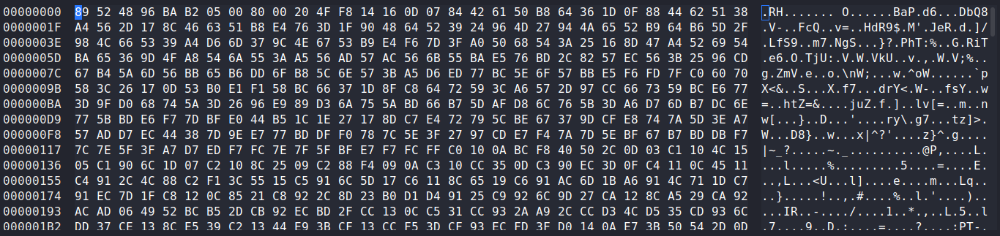

# Wolfie's Secret 
> Points: 497

## Description
> Wolfie hides some secret file but from sources we heard that he hides information in corrupt files

## Solution
During the CTF I was not able to find the secret file. After CTF I found it by recursive find and grep.
```bash
⚡ root@ignite  ~/Documents/darkCTF/mountpoint> find . -type f | grep Secret
./Program Files/Windows/system32/config/systemprofile/AppData/Local/Microsoft/Credentials/Secret
```
Since the mount is readonly I copied the `Secret` file to another postion and checked the hexdump. I couldn't understand any known format.

Then I ran strings and found some interesting stuff
```bash
<?xpacket begin='
' id='W5M0MpCehiHzreSzNTczkc9d'?>
<x:xmpmeta xmlns:x='adobe:ns:meta/' x:xmptk='Image::ExifTool 10.80'>
<rdf:RDF xmlns:rdf='http://www.w3.org/1999/02/22-rdf-syntax-ns#'>
 <rdf:Description rdf:about=''
  xmlns:Attrib='http://ns.attribution.com/ads/1.0/'>
  <Attrib:Ads>
   <rdf:Seq>
    <rdf:li rdf:parseType='Resource'>
     <Attrib:Created>2020-09-25</Attrib:Created>
     <Attrib:ExtId>2c1720da-2ed7-4fbd-b219-e6f910682462</Attrib:ExtId>
     <Attrib:FbId>525265914179580</Attrib:FbId>
     <Attrib:TouchType>2</Attrib:TouchType>
    </rdf:li>
   </rdf:Seq>
  </Attrib:Ads>
 </rdf:Description>
 <rdf:Description rdf:about=''
  xmlns:pdf='http://ns.adobe.com/pdf/1.3/'>
  <pdf:Author>Kishan Soni</pdf:Author>
 </rdf:Description>
 <rdf:Description rdf:about=''
  xmlns:xmp='http://ns.adobe.com/xap/1.0/'>
  <xmp:CreatorTool>Canva</xmp:CreatorTool>
 </rdf:Description>
</rdf:RDF>
</x:xmpmeta>
```
Researching a little I found out its a .tiff file. Changed the 1st 4 bytes to `49 49 2A 00`.
```bash
⚡ root@ignite  ~/Documents/darkCTF  file Secret
Secret: TIFF image data, little-endian, direntries=21, height=1920, bps=46028, compression=LZW, PhotometricIntepretation=RGB, orientation=upper-left, width=1080
```

## Flag
>darkCTF{F1x1ng_!m4g3_h34d3r_15_D1ff1cult}
