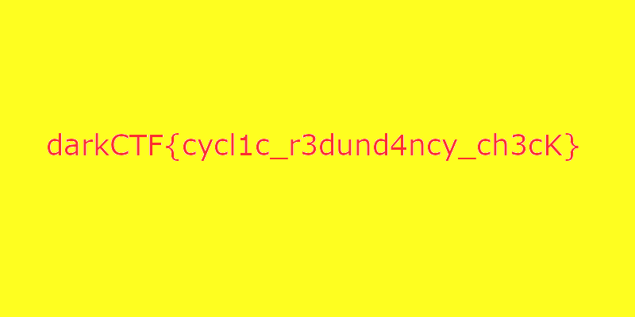

# Crcket
> Points: 475

## Description
```
DarkArmy's openers bagging as many runs as possible for our team.
    1st over: 86 runs
    2nd over: 37 runs
    3rd over: 4 runs
    4th over: 52 runs
```

## Solution
Doing `pngcheck` as this is a .PNG value.
```bash
⚡ root@ignite ~/Documents/darkCTF/Cricket > pngcheck -v -f crcket.png 
File: crcket.png (11321 bytes)
  chunk DARK at offset 0x0000c, length 13:  first chunk must be IHDR
:  illegal (unless recently approved) unknown, public chunk
  chunk zTXt at offset 0x00025, length 2171:  first chunk must be IHDR
  chunk iCCP at offset 0x008ac, length 390:  first chunk must be IHDR
  chunk bKGD at offset 0x00a3e, length 6:  first chunk must be IHDR
  chunk pHYs at offset 0x00a50, length 9:  first chunk must be IHDR
  chunk tIME at offset 0x00a65, length 7:  first chunk must be IHDR
  chunk tEXt at offset 0x00a78, length 25:  first chunk must be IHDR
  chunk DARK at offset 0x00a9d, length 8192:  first chunk must be IHDR
:  illegal (unless recently approved) unknown, public chunk
  chunk DARK at offset 0x02aa9, length 380:  first chunk must be IHDR
:  illegal (unless recently approved) unknown, public chunk
  chunk IEND at offset 0x02c31, length 0:  first chunk must be IHDR
:  no IDAT chunks
ERRORS DETECTED in crcket.png
```
Renamed the 1st `DARK` named chunk to IHDR and the others to `IDAT`
```bash
⚡ root@ignite ~/Documents/darkCTF/Cricket> pngcheck -v -f crcket.png
File: crcket.png (11321 bytes)
  chunk IHDR at offset 0x0000c, length 13:  invalid image dimensions (0x0)

    0 x 0 image, 32-bit RGB+alpha, non-interlaced
  CRC error in chunk IHDR (computed 3b8b7c12, expected 00000000)
  chunk zTXt at offset 0x00025, length 2171, keyword: Raw profile type exif
  chunk iCCP at offset 0x008ac, length 390
    profile name = ICC profile, compression method = 0 (deflate)
    compressed profile = 377 bytes
  chunk bKGD at offset 0x00a3e, length 6
    red = 0x0000, green = 0x0000, blue = 0x0000
  chunk pHYs at offset 0x00a50, length 9: 11811x11811 pixels/meter (300 dpi)
  chunk tIME at offset 0x00a65, length 7: 14 Sep 2020 13:07:51 UTC
  chunk tEXt at offset 0x00a78, length 25, keyword: Comment
  chunk IDAT at offset 0x00a9d, length 8192
    zlib: deflated, 32K window, maximum compression
  chunk IDAT at offset 0x02aa9, length 380
  chunk IEND at offset 0x02c31, length 0
ERRORS DETECTED in crcket.png
```
Now there is null bytes at width, height and crc of `IHDR`. I converted the values in the question and used it for crc and bruteforce width and height.<br>

**Script:**
```py
from binascii import crc32

correct_crc = int.from_bytes(b'\x56\x25\x04\x34',byteorder='big')

for h in range(4000):
    for w in range(4000):
        crc=b"\x49\x48\x44\x52"+w.to_bytes(4,byteorder='big')+h.to_bytes(4,byteorder='big')+b"\x08\x06\x00\x00\x00"
        if crc32(crc) % (1<<32) == correct_crc:
            print ('FOUND!')
            print ('Width: ',end="")
            print (hex(w))
            print ('Height :',end="")
            print (hex(h))
            exit()
```
```bash
⚡ root@ignite ~/Documents/darkCTF/Cricket> python3 bruteforce.py
FOUND!
Width: 0x320
Height :0x190
```
So I edited the hex with these values
```bash
File: new.png (11321 bytes)
  chunk IHDR at offset 0x0000c, length 13
    800 x 400 image, 32-bit RGB+alpha, non-interlaced
  chunk zTXt at offset 0x00025, length 2171, keyword: Raw profile type exif
  chunk iCCP at offset 0x008ac, length 390
    profile name = ICC profile, compression method = 0 (deflate)
    compressed profile = 377 bytes
  chunk bKGD at offset 0x00a3e, length 6
    red = 0x0000, green = 0x0000, blue = 0x0000
  chunk pHYs at offset 0x00a50, length 9: 11811x11811 pixels/meter (300 dpi)
  chunk tIME at offset 0x00a65, length 7: 14 Sep 2020 13:07:51 UTC
  chunk tEXt at offset 0x00a78, length 25, keyword: Comment
  chunk IDAT at offset 0x00a9d, length 8192
    zlib: deflated, 32K window, maximum compression
  chunk IDAT at offset 0x02aa9, length 380
  chunk IEND at offset 0x02c31, length 0
No errors detected in new.png (10 chunks, 99.1% compression).
```

## Flag
> darkCTF{cycl1c_r3dund4ncy_ch3cK}
