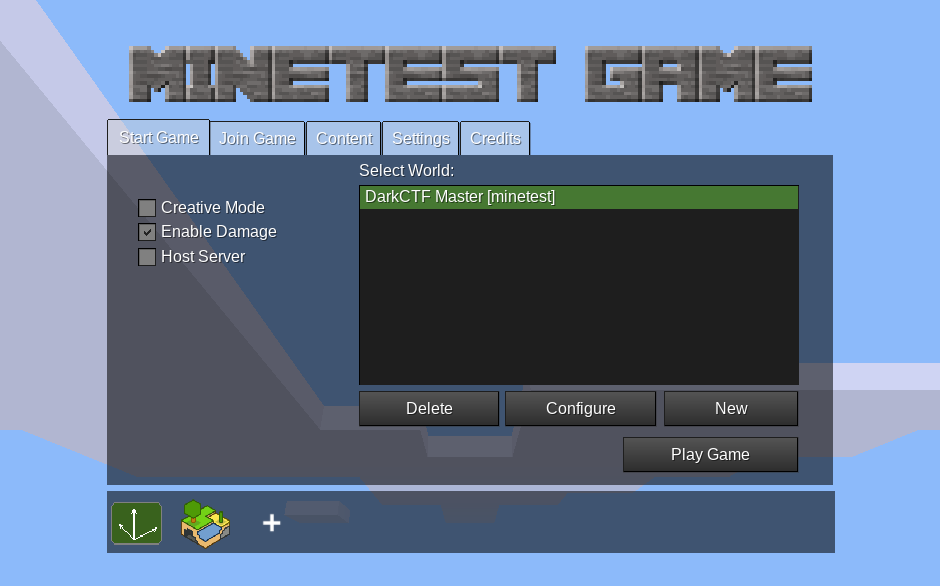
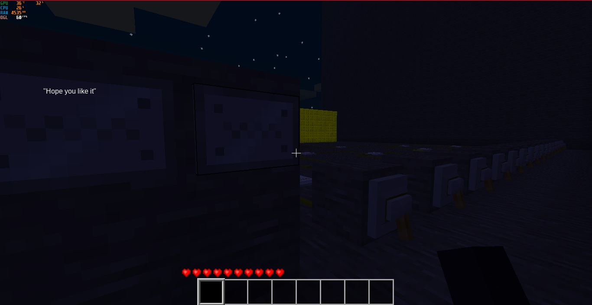
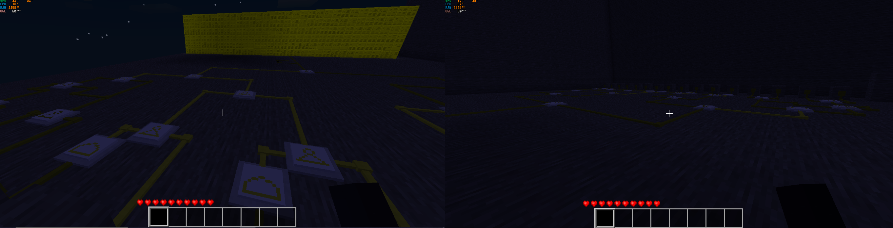
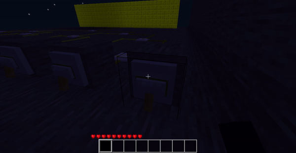
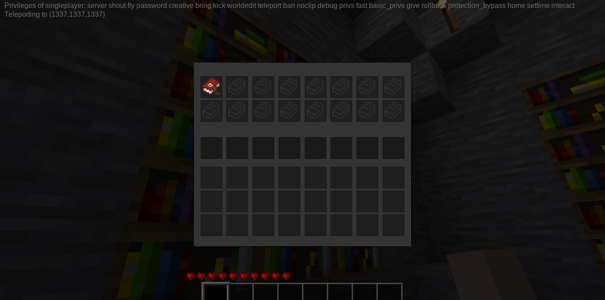
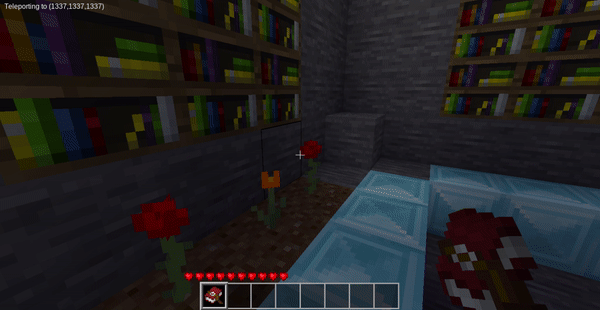

# Minetest 1
> Points: 303

## Description
>Just a sanity check to see whether you installed Minetest successfully and got into the game. 
[File](https://mega.nz/file/zxlhlAYL#1SbgYkhBMHqyeCWNNHNIASAxanpEMLi2CGxHjRod4k8)

## Solution
This was the best challenge for me in the whole event bcz I love games :) #gamer 
We are given `mods` and `worlds` folder of Minetest game. I downloaded the game on [windows](https://www.minetest.net/downloads/)
Copied the folders in the game directory and started the game. 

 

I was greeted with this.

Roaming around I see: There are 16 switches from which connections come and form a logical circuit with and, or , not gates
This means I have to on/off (0 or 1) the switches and solve the series of gates.

Completing a part of the connection brightens the circuit.
Finally completing the circuit triggers something (code block perhaps) and gives us the 1st flag and instructions to the next one. 

## Flag
>DarkCTF{y0u_5ucess_fu11y_1ns7alled_m1n37e57}

# Minetest 2
> Points: 427

## Description
>Someone messed up my world someone please help me recover my flag.

## Solution
We got this instruction from the last challenge `Teleport to the value you obtained from binary to decimal in the sense (xxxx, xxxx, xxxx) xxxx is the 4 digit number.`

From top to bottom (on = 1, off = 0) we get these `0 0 0 0 0 1 0 1 0 0 1 1 1 0 0 1` which transforms to 1337. At 1st I was having problems bcz the circuit can be completed without touching the 1st 4 switches. -_-

I got the got the location `(1337, 1337, 1337)` now I need to teleport to that location. Reading the Minetest Wiki I found it it can be done by `teleport` command but we need to get priviledges for that. Reading more I found out the required command is `/grant singleplayer teleport`. So I granted that and teleported to that location.

There are many bookshelves but most of them are empty. Finally got a book in a bookshelf.

Equipped the book and and opened it to get the flag and a key for some ciphertext

## Flag
>darkCTF{y0u_4r3_4_1337_p14y3r}
