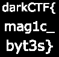

## Challenge: Flag of Life
>Magic is in the air! Want a byte of it?<br>
[File](https://mega.nz/file/uo8GyD7B#TQG1juK6dKWx2x2kgSsTpYVip992r7-nW7fbNgYJCAE)
## Solution
We are given 10000 .jpg files named flag_0_0.jpg to flag_99_99.jpg<br>
Looking into the hexdump we see that they are small png files which headers are changed to JFIF.
```bash
 xxd flag_0_0.jpg
00000000: ffd8 ffe0 0010 4a46 4946 0000 000d 4948  ......JFIF....IH
00000010: 4452 0000 0014 0000 0014 0806 0000 008d  DR..............
00000020: 891d 0d00 0000 2249 4441 5478 9c63 6460  ......"IDATx.cd`
00000030: 60f8 cf40 45c0 444d c346 0d1c 3570 d4c0  `..@E.DM.F..5p..
00000040: 5103 470d 1c4a 0602 00ce ee01 27ff 98d1  Q.G..J......'...
00000050: 9a00 0000 0049 454e 44ae 4260 82         .....IEND.B`.
```
Fixing one PNG we see they it's square image of black colour.<br>
**Deduction:** These are like pixels of a 100x100 sized image and most probably a black and white one.<br>
Wrote a script to find out which are not black i.e. different from the 1st file
```bash
...
Binary files flag_0_0.jpg and flag_90_25.jpg differ
Binary files flag_0_0.jpg and flag_90_26.jpg differ
Binary files flag_0_0.jpg and flag_90_57.jpg differ
...
```
Wrote a script to make an image from these pixels, background: black, different files: white
```py
from PIL import Image  

array=(
	(4,14),
  ...
	(91,26),
)

img = Image.new( 'RGB', (100,100), "black") # create a new black image
pixels = img.load() # create the pixel map

c = 0

for i in array:    # for every col:
	pixels[i[0],i[1]] = (255, 255, 255) # set the colour accordingly

img.show()
```
**Final Image**<br>

## Flag:
>darkCTF{mag1c_byt3s}
