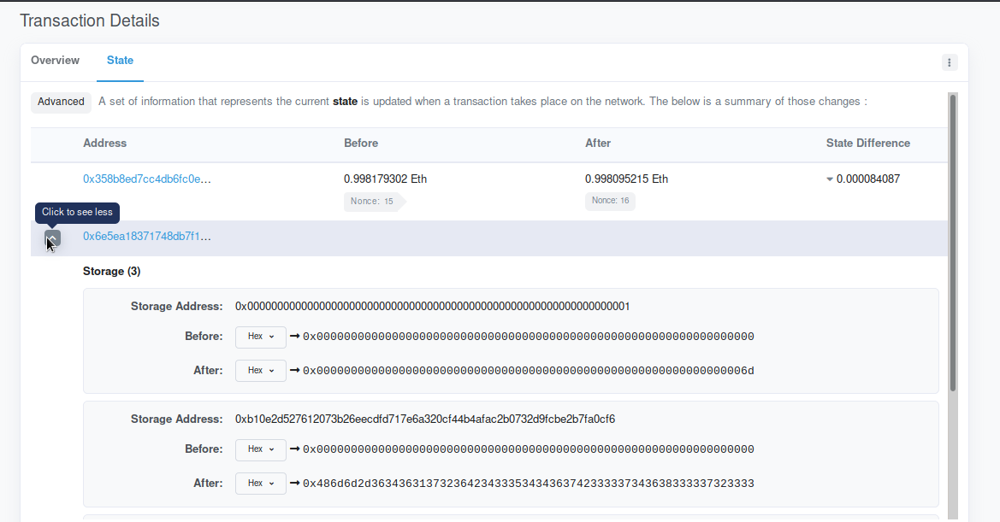
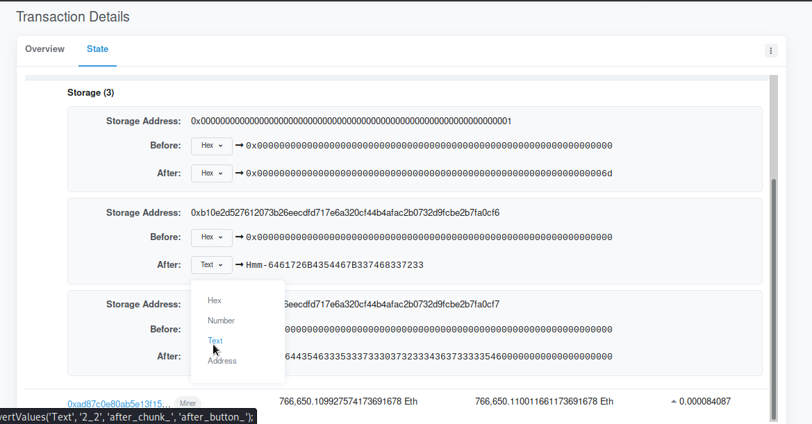

# Secret Of The Contract
> Points: `465`

> Author: `Catamob, RDxR10`

## Description
> Ropsten network contains my dark secret. Help us find it. Name of the contract was 0x6e5EA18371748Db7F12A70037d647cDFCf458e45

## Solution
A quick Google search led us to [TESTNET Ropsten (ETH) Blockchain Explorer](https://ropsten.etherscan.io/) where we can search for our contract
[0x6e5EA18371748Db7F12A70037d647cDFCf458e45](https://ropsten.etherscan.io/address/0x6e5EA18371748Db7F12A70037d647cDFCf458e45). 

If we check the Transaction Details and go to the [State](https://ropsten.etherscan.io/tx/0x4cfd851b6e64e2f96ba7396c09965987e5a8a0ad8a294afacea25414a1080091#statechange) Tab of the first Transaction, we can 
Tab we can see,



The `Storage Address:` and `hex values` which when turned to Text, gives us the value `Hmm-6461726B4354467B337468337233` (suspicious right?)



When we hex-decode this value we get,
```python
>>> bytes.fromhex('6461726B4354467B337468337233')
b'darkCTF{3th3r3'
```
Therefore, we can take all the Text values(hex values to be more specific) from these two Transaction Details and concatenate them to get the flag.

```python
>>> bytes.fromhex('6461726B4354467B337468337233756D5F353730723467335F3772346e3534633731306e7d')
b'darkCTF{3th3r3um_570r4g3_7r4n54c710n}'
```
## Flag
> darkCTF{3th3r3um_570r4g3_7r4n54c710n}
