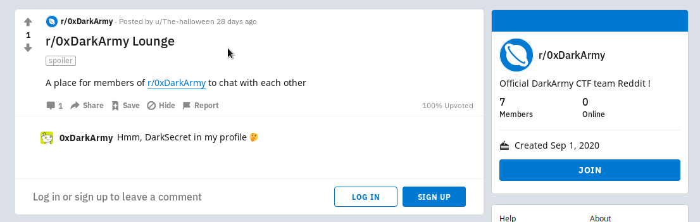
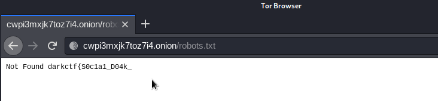
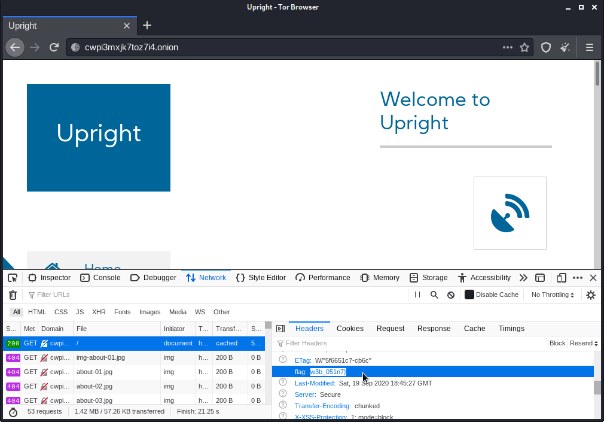

# Dark Social Web 
> Points: 472

## Description
> 0xDarkArmy has 1 social account and DarkArmy uses the same name everywhere. Hint: The front page of internet
>
> flag format: darkctf{}

## Solution

* I checked [Twitter](https://twitter.com/0xDarkArmy) and [Instagram](https://www.instagram.com/0xDarkArmy/) with this id `0xDarkArmy` but nothing special was there.

> They released the Hint later `;-;`

* Then I found the [Reddit](https://www.reddit.com/r/0xDarkArmy/comments/ikf8v8/r0xdarkarmy_lounge/) post with a comment...

* I was kinda sure that I'm on a right track. So, I used this site - [ZXing Decoder Online](https://zxing.org/w/decode.jspx) to decode the QR code and it gave us an  
URL - [https://qrgo.page.link/zCLGd](https://qrgo.page.link/zCLGd)

* It's an **[.onion site](http://cwpi3mxjk7toz7i4.onion/)** so I opened it using **Tor**.
* After checking the `Page Source` and testing the `robots.txt` I got the 1st part of the flag!  `\(^.^)/`

After this I could not solve the challenge `;-;`

After the CTF was over, my teammate and I got the 2nd part of the flag with the help of the special Hint provided by the Admin.

## Flag
> darkctf{S0c1a1_D04k_w3b_051n7}
