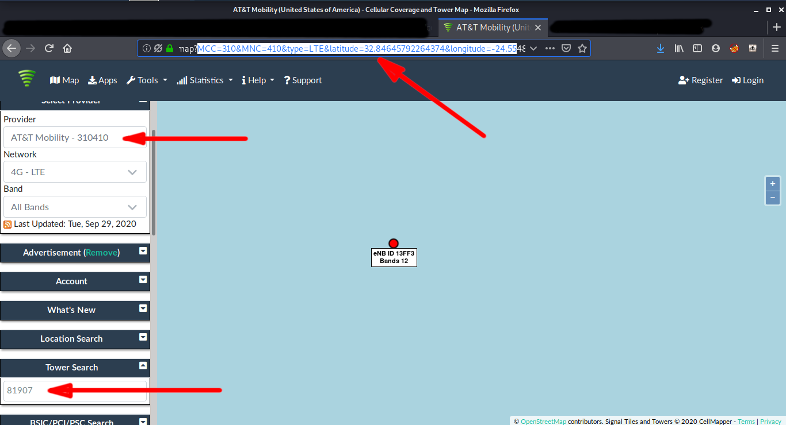

# Find cell 
> Points: 390

# Description
> I lost my phone while I was travelling back to home, I was able to get back my eNB ID, MCC and MNC could you help me catch the tower it was last found.
>
> note: decimal value upto 1 digit
>
> Flag Format : darkCTF{latitude,longitude}
>
> Downloads
>
> [challenge.txt](challenge.txt)

# Solution
* A quick Google search about `find cell tower with eNB ID, MCC and MNC` led us to this site - [cellmapper](https://www.cellmapper.net). 
* We can go to the Map Tab and enter the `eNB ID, MCC and MNC` to locate the tower.

## Flag
> darkCTF{32.8,-24.5}
