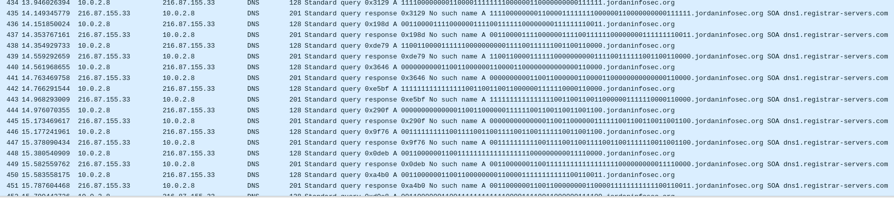

# Square

## Description
> Something weird in our traffic

## Solution
There is some fishy DNS queries<br>
<br>
Extracting them looks like a QR in 0s and 1s
```
00000000000000111111110011000011111100000000000000
00000000000000111111110011000011111100000000000000
00111111111100110000111100111100111100111111111100
00111111111100110000111100111100111100111111111100
00110000001100110011000011110011001100110000001100
00110000001100110011000011110011001100110000001100
00110000001100111100111111111100001100110000001100
00110000001100111100111111111100001100110000001100
00110000001100110000111111110011001100110000001100
00110000001100110000111111110011001100110000001100
00111111111100110011001100001111111100111111111100
00111111111100110011001100001111111100111111111100
00000000000000110011001100110011001100000000000000
00000000000000110011001100110011001100000000000000
11111111111111110011000000001100111111111111111111
11111111111111110011000000001100111111111111111111
00001100111100001111111100110000111100000011000011
00001100111100001111111100110000111100000011000011
00001100000011000000110000001111000000001100111100
00001100000011000000110000001111000000001100111100
11001111111100001111110000001111000011110000110011
11001111111100001111110000001111000011110000110011
00110011000011001100001111001100000011000011110011
00110011000011001100001111001100000011000011110011
11001111000000001111001111111100000000110011001111
11001111000000001111001111111100000000110011001111
11110000000011000011111111000000110000000000111111
11110000000011000011111111000000110000000000111111
00110000111100000011110011111100000000111111110011
00110000111100000011110011111100000000111111110011
11001100001111110000000000111100111111001100110000
11001100001111110000000000111100111111001100110000
00000000001100110000001100001100000000000000110000
00000000001100110000001100001100000000000000110000
11111111111111110011001100110000001111110000110000
11111111111111110011001100110000001111110000110000
00000000000000110011000000111111001100110011001100
00000000000000110011000000111111001100110011001100
00111111111100111100110011110011001111110011001100
00111111111100111100110011110011001111110011001100
00110000001100111111111111111111000000000011110000
00110000001100111111111111111111000000000011110000
00110000001100110000000011000011111111111100110011
00110000001100110000000011000011111111111100110011
00110000001100111111111111000011110011000000111100
00110000001100111111111111000011110011000000111100
00111111111100110011111100001111110000110011001100
00111111111100110011111100001111110000110011001100
00000000000000110000000011001100111100001111111100
00000000000000110000000011001100111100001111111100
```
Converted into a image with PIL<br>

Ran zbarimg to get the flag.
```sh
$ zbarimg QR.png                                                                                                                                                                                                                    ─╯
QR-Code:JISCTF{D0KX_4R3_4RK1V3D_F1L3S}
```
## Flag
> JISCTF{D0KX_4R3_4RK1V3D_F1L3S}
