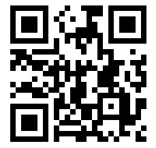
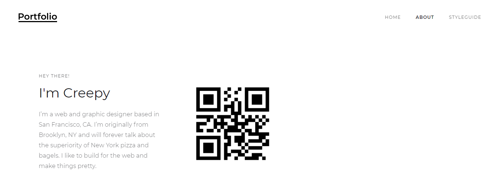
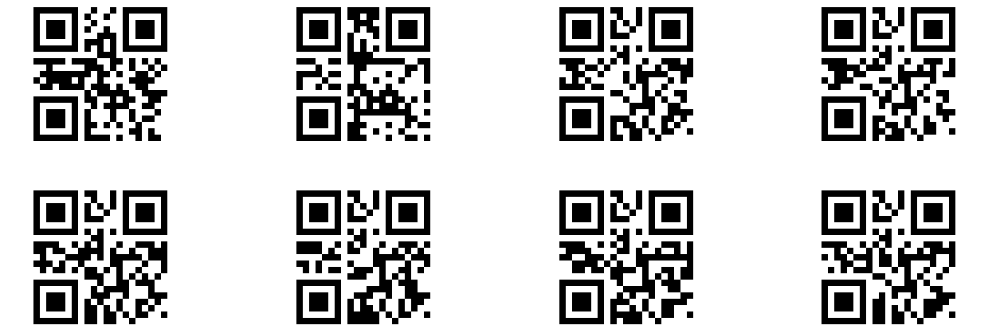

## Challenge: Quarantina
> 

## Solution: 
We are given a bad qr code which we need to fix. There are two ways of solving it, using image editors and stretch it, but I used paint to create a new qr code. I zoomed to 800% and drew the qr code pixel by pixel.

By scanning it we get this site: https://qrgo.page.link/ePLn7
In that site we stumble upon many qr codes.

The above Code gives us pctf{fakeflag}

Scanning these gives us parts of the flag. Assembling this we get the flag.
## Flag:
>pctf{sc4nning_should_b3_1ll3g4l}
