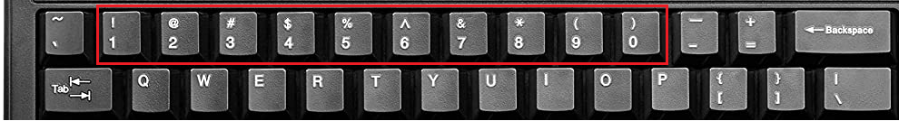

# I love symbols


## Description
> I love symbols can you find out what I want to say to you

> %@$%%#%$$#$f$e_&b_%(#0%%%f$$#!$$%f%$$*#!%#&d

> Flag Format : RESTCON{<- FLag ->}

> Hint: mY kEybOard !s br)ken.

## Solution
Tried a lot but couldn't solve it without the hint. The `!s br)ken.` part of the HINT got my eye on the number pad of my keyboard and I wrote a python script
to decode these special characters to numbers.



**Python Script**:

```python
sym = { 
	'!' : '1',
	'@' : '2', 
	'#' : '3', 
	'$' : '4', 
	'%' : '5', 
	'^' : '6', 
	'&' : '7', 
	'*' : '8', 
	'(' : '9', 
	')' : '0' 
}

cipher = "%@$%%#%$$#$f$e_&b_%(#0%%%f$$#!$$%f%$$*#!%#&d"
for i in cipher:
	try: 
		print(sym[i], end='') 
	except: 
		print(i, end='')
```
The output was : `52455354434f4e_7b_5930555f4431445f544831537d`

Then **hex-decoding** it led us to the flag.

> Flag: RESTCON{Y0U_D1D_TH1S}
