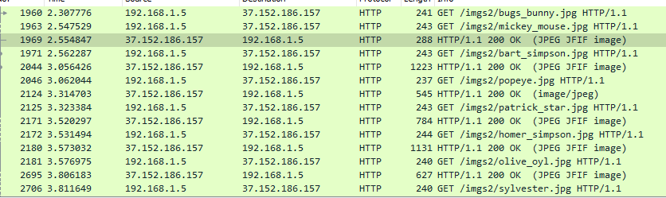

# Meeting 
> Points: 1000

## Description
> Mickey Mouse goes to visit his friend and orders two pizzas in a phone call. Deliver the pizza to him. Hint: Related to Steganography

## Solution
Read first part [here](https://github.com/t3rmin0x/CTF-Writeups/tree/master/Razi%20CTF/Android/Friends)<br>
As the hint states steganography it's something related to images... So I re-installed the app and monitored traffic with wireshark. I saw the images are downloaded and not inside the apk itself.
<br>
I extracted the image from wireshark. Made a wordlist of the phone numbers we got. Ran stegcracker.
```bash
┌──(root💀ignite)-[~/CTF/Razi/Pics]
└─# cat wordlist.txt        
36213893021
12369532255
55634559910
22361255893
41223365236
99632531930
89633366552
77632351752
┌──(root💀ignite)-[~/CTF/Razi/Pics]
└─# stegcracker mickey_mouse.jpg wordlist.txt
StegCracker 2.0.9 - (https://github.com/Paradoxis/StegCracker)
Copyright (c) 2020 - Luke Paris (Paradoxis)

Counting lines in wordlist..
Attacking file 'mickey_mouse.jpg' with wordlist 'wordlist.txt'..
Successfully cracked file with password: 22361255893
Tried 4 passwords
Your file has been written to: mickey_mouse.jpg.out
22361255893

┌──(root💀ignite)-[~/CTF/Razi/Pics]
└─# cat mickey_mouse.jpg.out
39.600098, 2.925191
```
## Flag
> RaziCTF{39.600098, 2.925191}
