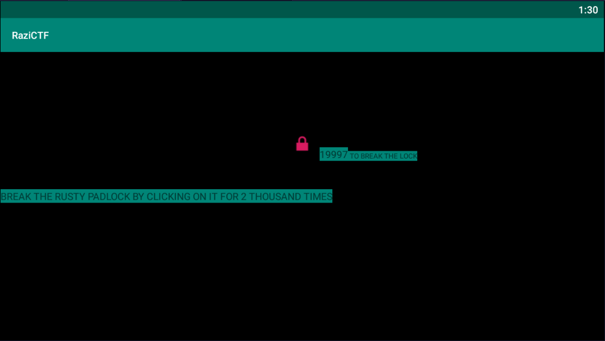

# Strong Padlock
> Points: 989

## Description
> I heard some where that if you hit a padlock enough they will give you a flag? is that true?

## Solution
Similar to chasing a lock<br>
<br>
Decompiled the APK with jadx-gui. The Main Activity calls a class named `switcher` this assembles the flag from 5 functions.
```java
public class switcher {
    public String run(int i) {
        if (i == 18) {
            return new a1().run(i);
        }
        if (i == 15) {
            return new a2().run(i);
        }
        if (i == 12) {
            return new a3().run(i);
        }
        if (i == 10) {
            return new a4().run(i);
        }
        if (i == 5) {
            return new a5().run(i);
        }
        return null;
    }
}
```
### Function a1
```java
public class a1 {
    public String run(int i) {
        String str = "Vm0wd2QyUXlVWGxWV0d4V1YwZDRWMVl3WkRSV01WbDNXa1JTVjAxV2JETlhhMUpUVmpBeFYySkVUbGhoTVVwVVZtcEJlRll5U2tWVWJHaG9UVlZ3VlZadGNFSmxSbGw1VTJ0V1ZXSkhhRzlVVmxaM1ZsWmFkR05GU214U2JHdzFWVEowVjFaWFNraGhSemxWVm14YU0xWnNXbUZqVmtaMFVteFNUbUpGY0VwV2JURXdZVEZrU0ZOclpHcFRSVXBZV1ZSR2QyRkdjRmRYYlVaclVsUkdWbFpYZUZOVWJVWTJVbFJHVjJFeVVYZFpla3BIWXpGT2RWVnRhRk5sYlhoWFZtMXdUMVF3TUhoalJscFlZbFZhY2xWcVFURlNNV1J5VjJ4T1ZXSlZjRWRaTUZaM1ZqSktWVkpZWkZkaGExcFlXa1ZhVDJNeFpITmhSMnhUVFcxb1dsWXhaRFJpTWtsNVZtNU9WbUpHV2xSWmJGWmhZMVphZEdSSFJrNVNiRm93V2xWYVQxWlhTbFpqUldSYVRVWmFNMVpxU2t0V1ZrcFpXa1p3VjFKV2NIbFdWRUpoVkRKT2MyTkZhR3BTYXpWWVZXcE9iMkl4V1hoYVJGSldUVlZzTlZaWE5VOVhSMHBJVld4c1dtSkdXbWhaTW5oWFkxWkdWVkpzVGs1V01VbzFWbXBKTVdFeFdYZE5WVlpUWVRGd1YxbHJXa3RUUmxweFVtMUdVMkpWYkRaWGExcHJZVWRGZUdOSE9WZGhhMHBvVmtSS1QyUkdTbkpoUjJoVFlYcFdlbGRYZUc5aU1XUkhWMjVTVGxOSFVuTlZha0p6VGtaVmVXUkhkRmhTTUhCSlZsZDRjMWR0U2tkWGJXaGFUVzVvV0ZsNlJsZGpiSEJIV2tkc1UySnJTbUZXTW5oWFdWWlJlRmRzYUZSaVJuQlpWbXRXZDFZeGJISlhhM1JVVW14d2VGVnRNVWRWTWtwV1lrUmFXR0V4Y0hKWlZXUkdaVWRPU0U5V1pHaGhNSEJ2Vm10U1MxUXlVa2RUYmtwaFVtMW9jRlpxU205bGJHUllaVWM1YVUxcmJEUldNV2h2V1ZaS1IxTnVRbFZXTTFKNlZHdGFZVk5IVWtoa1JtUnBWbGhDU1ZacVNqUlZNV1IwVTJ0a1dHSlhhR0ZVVnpWdlYwWnJlRmRyWkZkV2EzQjZWa2R6TVZZd01WWmlla1pYWWxoQ1RGUnJXbEpsUm1SellVWlNhVkp1UW5oV1YzaHJWVEZzVjFWc1dsaGlWVnBQVkZaYWQyVkdWWGxrUkVKWFRWWndlVmt3V25kWFIwVjRZMFJPV21FeVVrZGFWM2hIWTIxS1IxcEhiRmhTVlhCS1ZtMTBVMU14VlhoWFdHaFlZbXhhVmxsclpHOWpSbHB4VTIwNWJHSkhVbGxhVldNMVlWVXhjbUpFVWxkTmFsWlVWa2Q0YTFOR1ZuTlhiRlpYVFRGS05sWkhlR0ZXTWxKSVZXdG9hMUl5YUhCVmJHaENaREZhYzFwRVVtcE5WMUl3VlRKMGExZEhTbGhoUjBaVlZucFdkbFl3V25KbFJtUnlXa1prVjJFelFqWldhMlI2VFZaa1IxTnNXbXBTVjNoWVdXeG9RMVJHVW5KWGJFcHNVbTFTZWxsVldsTmhSVEZ6VTI1b1YxWjZSVEJhUkVaclVqSktTVlJ0YUZOaGVsWlFWa1phWVdReVZrZFdXR3hyVWtWS1dGUldXbmRsVm10M1YyNWtXRkl3VmpSWk1GSlBWMjFGZVZWclpHRldNMmhJV1RJeFMxSXhjRWhpUm1oVFZsaENTMVp0TVRCVk1VMTRWbGhvV0ZkSGFGbFpiWGhoVm14c2NscEhPV3BTYkhCNFZUSXdOV0pIU2toVmJHeGhWbGROTVZsV1ZYaGpiVXBGVld4a1RtRnNXbFZXYTJRMFlURk9SMVp1VGxoaVJscFlXV3RvUTFkV1draGxSMFpYVFd4S1NWWlhkRzloTVVwMFZXczVWMkZyV2t4Vk1uaHJWakZhZEZKdGNFNVdNVWwzVmxSS01HRXhaRWhUYkdob1VqQmFWbFp1Y0Zka2JGbDNWMjVLYkZKdFVubFhhMXByVmpKRmVsRnFXbGRoTWxJMlZGWmFXbVF3TVZkWGJXeHNZVEZ3V1ZkWGVHOVJNVkpIVlc1S1dHSkZjSE5WYlRGVFpXeHNWbGRzVG1oV2EzQXhWVmMxYjFZeFdYcGhTRXBYVmtWYWVsWnFSbGRqTVdSellVZHNWMVp1UWpaV01XUXdXVmRSZVZaclpGZFhSM2h5Vld0V1MxZEdVbGRYYm1Sc1ZteHNOVnBWYUd0WFIwcEhZMFpvV2sxSFVuWldNbmhoVjBaV2NscEhSbGRXTVVwUlZsZHdTMUl4U1hsU2EyaHBVbXMxY0ZsVVFuZE5iRnAwVFZSQ1ZrMVZNVFJXVm1oelZtMUZlVlZzV2xwaVdGSXpXVlZhVjJSSFZrWmtSM0JUWWtoQ05GWnJZM2RPVm1SSFYyNU9hbEp0ZUdGVVZWcFdUVlpzVjFaWWFHcGlWWEJHVmxkNGExUnRSbk5YYkZaWVZtMVJNRlY2Um1GamF6VlhZa1pLYVZKc2NGbFhWM1JoWkRGa1YxZHJhR3RTTUZwdlZGZHpNV1ZzV1hsT1ZrNW9UVlZzTlZsVmFFTldiVXBJWVVWT1lWSkZXbWhaZWtaM1VsWldkR05GTlZkTlZXd3pWbXhTUzAxSFJYaGFSV2hVWWtkb2IxVnFRbUZXYkZwMFpVaGtUazFXY0hsV01qRkhZV3hhY21ORVFtRlNWMUYzVm1wS1MyTnNUbkpoUm1SVFRUSm9iMVpyVWt0U01WbDRWRzVXVm1KRlNsaFZiRkpYVjFaYVIxbDZSbWxOVjFKSVdXdGFWMVZzWkVoaFJsSlZWbTFTVkZwWGVITldiR1J6Vkcxb1UxWkZXalpXVkVreFlqRlplRmRZY0ZaaVIyaFpWbTE0ZDFsV2NGWlhiWFJyVm10d2VsWnRNWE5XTVVsNllVUldWMDFYVVhkWFZtUlNaVlphY2xwR1pHbGlSWEI1VmxkMFYxTXlTWGhpUm14cVVsZFNjMVp0ZUV0bGJGcDBUVVJXV0ZJd2NFaFpNRnB2VjJzeFNHRkZlRmROYm1ob1ZqQmFWMk5zY0VoU2JHUk9UVzFvU2xZeFVrcGxSazE0VTFob2FsSlhVbWhWYlhNeFYwWlpkMVpyZEU1aVJuQXdXVEJXYTFkc1dYZFdhbEpYWWtkb2RsWXdXbXRUUjBaSFYyeHdhVmRIYUc5V2JURTBZekpPYzFwSVNtdFNNMEpVV1d0YWQwNUdXbGhOVkVKT1VteHNORll5TlU5aGJFcFlZVVpvVjJGck5WUldSVnB6VmxaR1dXRkdUbGRoTTBJMlZtdGtORmxXVlhsVGExcFlWMGhDV0Zac1duZFNNVkY0VjJ0T1ZtSkZTbFpVVlZGM1VGRTlQUT09";
        int i2 = 0;
        while (i2 < 20) {
            i2++;
            str = new String(Base64.decode(str.getBytes(), 0));
        }
        return str;
    }
}
```
Decoding the base64 string 19 times gives `RaziCTF`

### Function a2
```java
public class a2 {
    public String run(int i) {
        return xorHex("6107577B5D222546", "313333376d616e73313333376861");
    }

    public String xorHex(String str, String str2) {
        char[] cArr = new char[str.length()];
        int i = 0;
        for (int i2 = 0; i2 < cArr.length; i2++) {
            cArr[i2] = toHex(fromHex(str.charAt(i2)) ^ fromHex(str2.charAt(i2)));
        }
        StringBuilder sb = new StringBuilder();
        while (i < new String(cArr).length()) {
            int i3 = i + 2;
            sb.append((char) Integer.parseInt(new String(cArr).substring(i, i3), 16));
            i = i3;
        }
        return "{" + sb.toString().trim();
    }
```
It xors `0x6107577B5D222546` with `0x313333376d616e73313333376861` and decodes from hex and gives `{P4dL0CK5`

### Function a3
```java
public class a3 {
    public String run(int i) {
        return "_" + ((i % 100000) / 4) + "R" + 4;
    }
}
```
Returns `_3R4` (as i=12 from switcher)

### Function a4
```java
public class a4 {
    public String run(int i) {
        return "_FUN";
    }
}
```
Returns `_FUN`

### Function a5
This is the most complicated function jadx can't decompile most of it's code. The interesting parts are...
```java
            java.lang.String r0 = "="
            java.lang.String r1 = "%"
            java.lang.String r2 = "_"
            java.lang.String[] r3 = new java.lang.String[]{r2, r1, r0}
            java.lang.String r4 = "a"
            java.lang.String r5 = "b"
            java.lang.String r6 = "T"
            java.lang.String[] r5 = new java.lang.String[]{r4, r5, r6}
            java.lang.String r6 = "0"
            java.lang.String r7 = "1"
            java.lang.String r8 = "2"
            java.lang.String[] r7 = new java.lang.String[]{r7, r6, r8}
            java.lang.String[] r1 = new java.lang.String[]{r2, r1, r0}
            java.lang.String r0 = "A"
            java.lang.String r2 = "B"
            java.lang.String r8 = "D"
            java.lang.String[] r2 = new java.lang.String[]{r0, r2, r8}
            java.lang.String r0 = "3"
            java.lang.String r8 = "R"
            java.lang.String r9 = "$"
            java.lang.String[] r8 = new java.lang.String[]{r8, r0, r9}
            java.lang.String r9 = "H"
            java.lang.String r10 = "q"
            java.lang.String[] r9 = new java.lang.String[]{r9, r10, r0}
            java.lang.String r0 = "4"
            java.lang.String r10 = ")"
            java.lang.String r11 = "("
            java.lang.String[] r10 = new java.lang.String[]{r0, r10, r11}
            java.lang.String r0 = "I"
            java.lang.String r11 = "J"
            java.lang.String r12 = "K"
            java.lang.String[] r11 = new java.lang.String[]{r0, r11, r12}
            java.io.PrintStream r0 = java.lang.System.out
            r0.println(r4)
            .....
            if (r10 >= r13) goto L_0x0152
            java.lang.StringBuilder r0 = new java.lang.StringBuilder
            r0.<init>()
            r13 = r3[r12]
            r0.append(r13)
            r13 = r5[r14]
            r0.append(r13)
            r13 = r7[r15]
            r0.append(r13)
            r13 = r1[r12]
            r0.append(r13)
            r13 = r2[r4]
            r0.append(r13)
            r13 = r8[r6]
            r0.append(r13)
            r13 = r9[r11]
            r0.append(r13)
            r13 = r18[r19]
            r0.append(r13)
            r13 = r17[r10]
            r0.append(r13)
            java.lang.String r0 = r0.toString()
            java.lang.StringBuilder r13 = new java.lang.StringBuilder
            r13.<init>()
            r13.append(r0)
            java.lang.String r0 = "}"
            r13.append(r0)
            java.lang.String r0 = r13.toString()
```
The code is too complicated to understand..
I bruteforced the digits after the 1st one bcz it's obviously `_` and searched for meaningful word. Generated a simple wordlist for indices with crunch for bruteforce `crunch 6 6 012 > combi`
```py

```
The meaningful word is ``
So the total return is `}`
## Flag
> RaziCTF{P4dL0CK5_4R3_FUN_T0_BR34K}
