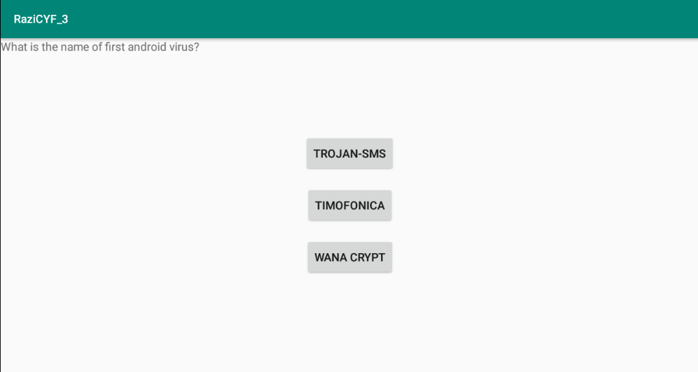
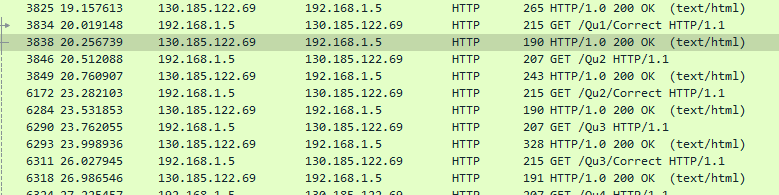

# Tough
> Points: 990

## Description
> can you answer these tough questions? wrap the string RaziCTF{} format

## Solution
The app ask questions with 3 choices, if we give correct answer then next question is shown else it starts from 1st. App>>> <br>
<br>
I set up a wireshark listener and started the app. It asks for questions, it receives the question, choices, and the number of the choice of the correct answer
```
GET /Qu1 HTTP/1.1
User-Agent: android dev
Accept-Language: en-US,en;q=0.5
Host: 130.185.122.69:5000
Connection: Keep-Alive
Accept-Encoding: gzip

HTTP/1.0 200 OK
Content-Type: text/html; charset=utf-8
Content-Length: 75
Server: Werkzeug/1.0.1 Python/3.8.5
Date: Wed, 28 Oct 2020 08:35:45 GMT

What is the name of first android virus?,Trojan-SMS,Timofonica,Wana crypt,1
```
If we give correct answer it sends `Correct` and we get a part of the flag.<br>

```
GET /Qu1/Correct HTTP/1.1
User-Agent: android dev
Accept-Language: en-US,en;q=0.5
Host: 130.185.122.69:5000
Connection: Keep-Alive
Accept-Encoding: gzip

HTTP/1.0 200 OK
Content-Type: text/html; charset=utf-8
Content-Length: 1
Server: Werkzeug/1.0.1 Python/3.8.5
Date: Wed, 28 Oct 2020 08:35:46 GMT

!
```
Answering all the questions and monitoring the flag part gives the flag.

## Flag
> RaziCTF{!_10v3_c1!3nt_b4s3d_qu!z_ch3ck!ng}
