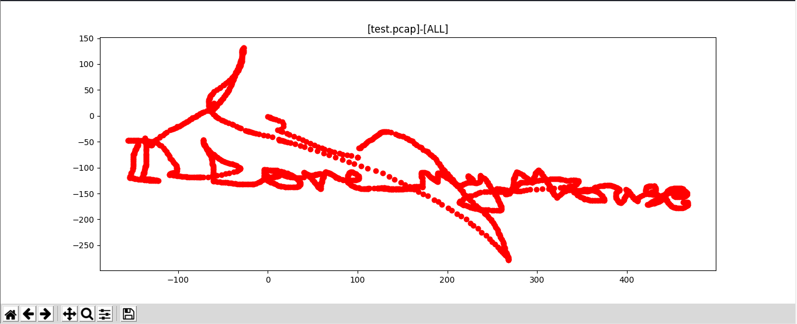

# Long Battery Life
> Points: 999

## Description
> Really long battery life and very durable! Hint: USB traffic from Wireless Mouse

## Solution
To understand the USB protocol data read [this](https://www.usb.org/sites/default/files/documents/hut1_12v2.pdf).
Wrote a enhanced version of [this script](https://github.com/WangYihang/UsbMiceDataHacker) 
The script takes the data and plots the mouse co-ordinates with tkinter and matplotlib

Running `python2 USB_mouse_decode.py 'Long Battery Life.pcap' ALL` gives this >>> 

## Flag
> RaziCTF{I_Love_My_Mouse}
