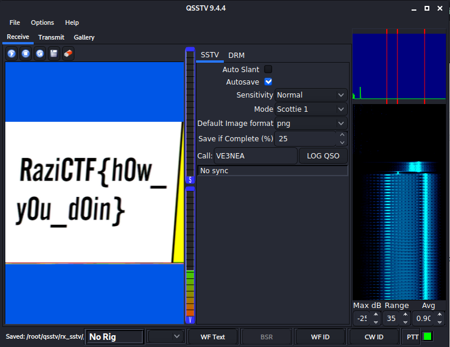

# Cliche
> 799 points

## Description
> I told my friend SCOTTIE that this challenge is cliché and he said I'm not the only 1 who thinks that way.  
> [file](enc.wav)

## Solution
* Upon listening to the audio file, we can guess that it's a [SSTV](https://en.wikipedia.org/wiki/Slow-scan_television) signal.
* We can use a program called `qsstv` to convert the audio back to the image.
* Tutorial: [How to convert (decode) a Slow-Scan Television transmissions (SSTV) audio file to images using QSSTV](https://ourcodeworld.com/articles/read/956/how-to-convert-decode-a-slow-scan-television-transmissions-sstv-audio-file-to-images-using-qsstv-in-ubuntu-18-04)
* However, I used [this script](https://github.com/r3yc0n1c/CTFs/blob/master/Tools/QSSTV/qsstv.sh) to configure and run `qsstv`.
* Result:

## Flag
> **RaziCTF{h0w_y0u_d0in}**
