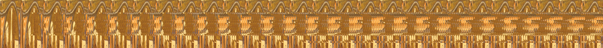

# Rhazes
> 986 points

## Description
> Find the hidden chemical formula in this depiction of an alchemist known as Rhazes. <br>
> [File](Rhazes.zip)

## Solution
The give zip file had a huge(~10 mb) `.jpg` image file with dimension `8536x9688`. 

```console
root@kali:~/Downloads/razi/steg/Rhazes# file Rhazes.jpg 
Rhazes.jpg: JPEG image data, JFIF standard 1.01, resolution (DPI), density 72x72, segment length 16, baseline, precision 8, 8536x9688, components 3
```
Using `exiftool`, `binwalk` and `stegsolve`, I got nothing significant. Then I used **steghide** with some random passwords related to the challenge and 
all of a sudden **`Rhazes`** worked and I got another image file (MagicSanitizer.jpg) which was hiden inside the main file.

```console
root@kali:~/Downloads/razi/steg/Rhazes# steghide extract -sf Rhazes.jpg -p "Rhazes"
wrote extracted data to "MagicSanitizer.jpg".
root@kali:~/Downloads/razi/steg/Rhazes# file MagicSanitizer.jpg 
MagicSanitizer.jpg: PNG image data, 4335 x 350, 8-bit/color RGBA, non-interlaced
```
Yes that was a `.png` file LOL. The image contained some kind of weird pattern and zooming into it, I found that there's **`R`** written but some kind of same 
pattern mask was applied to it.



So I opened **`stegsolve`** and used **`Analyse > Stereogram solver`**. After clicking a lot (at offset **161**), we can see the original flag!


## Flag
> **RaziCTF{C2H5OH_k1ll5_54r5_c0v_2}**
