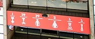
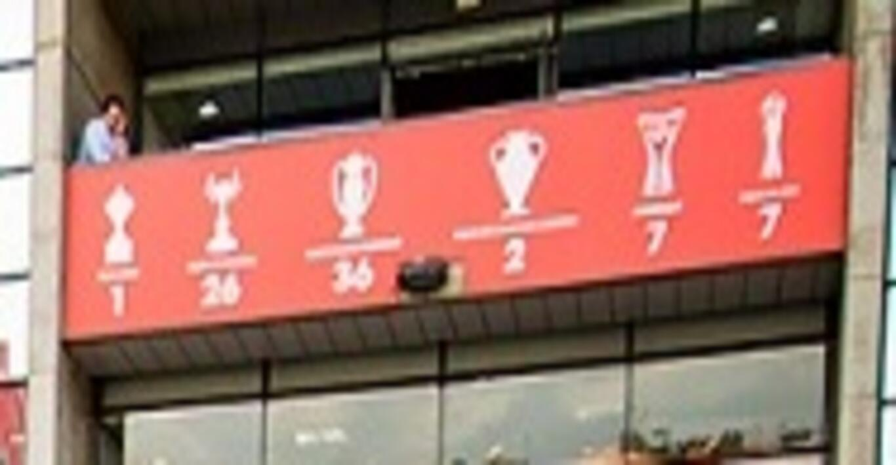

# Count the Cups
> 100 points

## Description
> All of them. <br>
> (maximum of 10 attempts) <br>
> Flag format: flag{number} <br>
> :arrow_down: [count_the_cups.jpg](count_the_cups.jpg)

## Solution
* The first attempt was to use **`exiftool`** and **`binwalk`** on the given file but nothing special was found.
* Then I tried **`steghide`** with no password and got the hidden file **steganopayload924364.txt**.
* Using **`file`** command I found that it's actually a JPEG image file.
```rb
root@kali:~/Downloads/stega/count_the_cups# file steganopayload924364.txt 
steganopayload924364.txt: JPEG image data, JFIF standard 1.01, resolution (DPI), density 96x96, segment length 16, baseline, precision 8, 188x78, components 3
```
* Changed the file extension to `.jpg` and got an inverted image.



* Flipped the image and counted the total number of **cups**.


## Flag
> flag{79}
