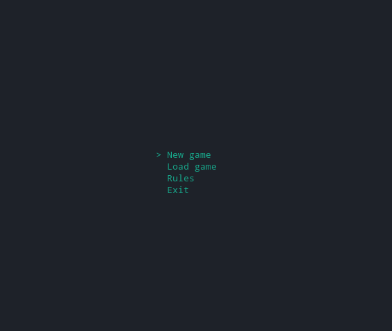
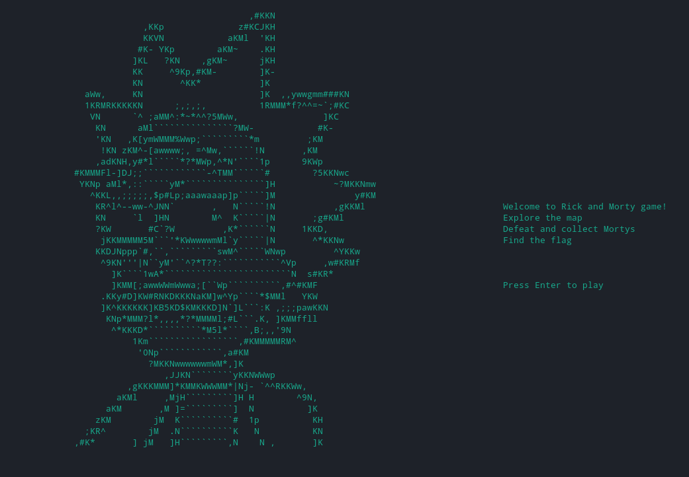
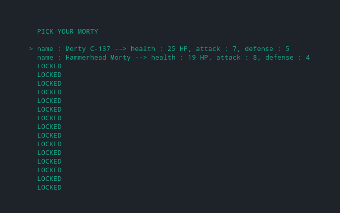
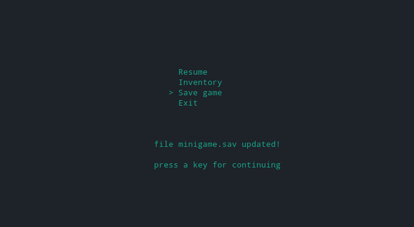
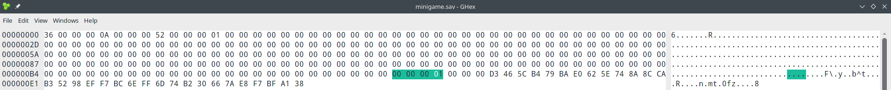
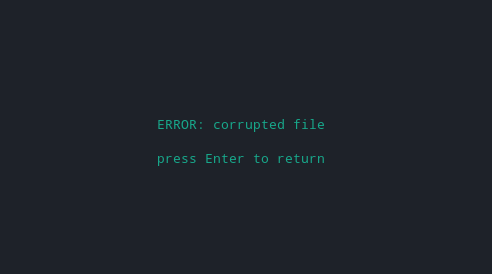
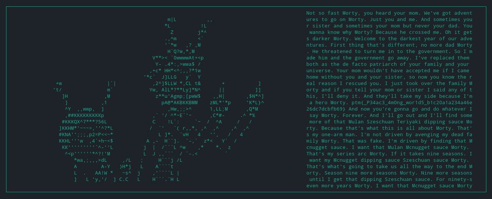

# The Rickshank Rickdemption
> Points: 179

## Description
> Welcome to the Rick and Morty universe! The council of Ricks have sent an army of Mortys ready to arrest Rick and cancel the interdimensional cable tv. Defeat them all, reach the last level and try to win. To be fair, you have to have a very high IQ to win.

## Solution
We are given a binary of a 2D game. Some game pics>>><br>







As the game uses a save file we can do the most common game hacking trick... **`EDIT THE SAVE FILE`**

By playing the game again and checking which variables store the values for what (4byte hex values at their offsets) I found this offset stores the current level.



So now we have to change this to the highest level... Now what is the highest level. As in the `Select Morty` menu there are 16 Morty's to be unlocked.. So maybe the highest level is 16...
I changed that `level value` to 16 and tried to load the game.



Ehh what??? So there must be a check for modification of the save file.
For that we need to analyze the binary. The binary is huge, took about 10 mins in both Ghidra and Binja to analyze.
As the error came in loading the binary I went to understand the pseudo code of the **`loadgame`** function

This is the important code>>>
```c
else {
  __ptr = (uint *)malloc(0xf4);
  fread(__ptr,0xf4,1,__stream);
  SHA256_Init(&local_258);
  uVar3 = (ulong)__ptr[0x34];
  sprintf(local_42,"%d-%d-%d",(ulong)*__ptr,(ulong)__ptr[1]);
  len = thunk_FUN_004010f6(local_42);
  SHA256_Update(&local_258,local_42,len);
  SHA256_Final(local_38,&local_258);
  iVar2 = CRYPTO_memcmp(__ptr + 0x35,local_38,0x20);
  if ((iVar2 == 0) && (-1 < (int)__ptr[0x34])) {
    local_1e8[0] = level1;
    local_1e8[1] = func1;
    local_1e8[2] = func18;
    local_1e8[3] = level2;
    local_1c8 = func2;
    local_1c0 = func19;
    local_1b8 = level3;
    local_1b0 = func3;
    local_1a8 = func20;
    local_1a0 = level4;
    local_198 = func4;
    local_190 = func21;
    local_188 = level5;
    local_180 = func5;
    local_178 = func22;
    local_170 = level6;
    local_168 = func6;
    local_160 = func23;
    local_158 = level7;
    local_150 = func7;
    local_148 = func24;
    local_140 = level8;
    local_138 = func8;
    local_130 = func25;
    local_128 = level9;
    local_120 = func9;
    local_118 = func26;
    local_110 = level10;
    local_108 = func10;
    local_100 = func27;
    local_f8 = level11;
    local_f0 = func11;
    local_e8 = func28;
    local_e0 = level12;
    local_d8 = func12;
    local_d0 = func29;
    local_c8 = level13;
    local_c0 = func13;
    local_b8 = func30;
    local_b0 = level14;
    local_a8 = func14;
    local_a0 = func31;
    local_98 = level15;
    local_90 = func15;
    local_88 = func32;
    local_80 = level16;
    local_78 = func16;
    local_70 = func33;
    local_68 = winFunc;
    local_60 = func17;
    local_58 = func34;
    (*local_1e8[(int)((__ptr[0x34] - 1) * 3)])(__ptr);
  }
  else {
    uVar1 = (local_290 + -0x1a) / 2;
    uVar4 = mvprintw(extraout_XMM0_Qa_02,param_2,param_3,param_4,param_5,param_6,param_7,param_8,
                     (local_28c + -5) / 2,uVar1,(undefined **)"ERROR: corrupted file",(ulong)uVar1
                     ,uVar3,in_R9,in_stack_fffffffffffffd68);
    uVar1 = (local_290 + -0x1a) / 2;
    uVar4 = mvprintw(uVar4,param_2,param_3,param_4,param_5,param_6,param_7,param_8,
                     (local_28c + -1) / 2,uVar1,(undefined **)"press Enter to return",(ulong)uVar1
                     ,uVar3,in_R9,in_stack_fffffffffffffd68);
    do {
      uVar1 = wgetch(uVar4,param_2,param_3,param_4,param_5,param_6,param_7,param_8,(short *)stdscr
                    );
      uVar4 = extraout_XMM0_Qa_03;
    } while (uVar1 != 10);
  }
}
```

So we see two things... There is a 17th function **`winFunc`** So we need to change the level to 17.

And the other thing is there is hash checking of the save value and if the result is **`0`** the game is loaded..
So we can bypass this by manually changing the value to 0 during dynamic analysis of the game with gdb

Now I run the game and attach the process to gdb. Set a breakpoint in the loadgame before the compare is called. `b *loadgame+594`
```
0x0000000000409187 <+583>:   call   0x6c2700 <CRYPTO_memcmp>
0x000000000040918c <+588>:   mov    DWORD PTR [rbp-0x280],eax
0x0000000000409192 <+594>:   cmp    DWORD PTR [rbp-0x280],0x0
0x0000000000409199 <+601>:   jne    0x4091b2 <loadgame+626>
```
Continue execution and called the `Load Game` in the main game. The program hits the breakpoint.
```sh
pwndbg> x/x $rbp-0x280
0x7ffcddca4c90: 0x00000001
```
Change the value and continue
```
set {int}0x7ffcddca4c90 = 0
```
And we get the flag



## Flag
> ptm{_P34ac3_4m0ng_wor1d5_b1c20a1a234a46e26dc7dcbfb69}
